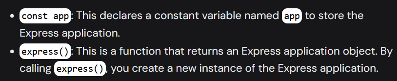
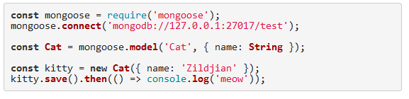

# Bookstore Learning Project for MERN stack
### MERN: MongoDB Express.js React.js Node.js

1. Creating backend, frontend, .gitignore, and README.md file
2. Initializing Project using ```npm init -y``` for package.json file -y gives yes prompt if requested automatcally
3. Adding "type":"module" to enable usage of ecmascript syntax
4. Adding express.js and nodemon modules ```npm i express nodemon```
5. Adding index.js file to manage and start off the project<br><br>
    1. 
    2. add app.listen call back function for checking the server
6. Adding config.js file to declare port variable for listening then 5.2
7. Creating http route, using app.get('/') call back function w/ status code 234
8. Installing mongodb using `npm i mongodb mongoose` and going to MongoDB.com to create a database and connecting it to the project using mongoose.connect().then().catch() call back functions
    - **mongoose**: object data monitoring library
    - 
    - creating models folder and bookModel.js to store models and their schemas and then exporting them for use in other files
9. Using app.post (express js) to asynchronously req data and create a newbook obj and send that data
10. Using Postman to post books data to localhost:5555 and adding app.use(express.json()) middleware for parsing received data
11. Creating routes '/books' for getting data and posting data, '/books/:id' for getting data, updating data and deleting data by id and refractoring the above code by using express routes
12. **CORS policy** in Node.js and Express.js
    - cors: cross origin resource sharing
    - sometimes different clients' requests might be access blocked by cors policy
    - its a security mechanism in browsers which prevents unauth cross origin access/ ability of a webpage to req diff domains 
    - the browser first sends req to target server when req to access oth domain and the server checks whether the req is permitted or not
    - installing cors and using it as a middleware in index.js as `app.use(cors())` or `app.use(cors({origin:.., methods:[..], allowedHeaders: []}))`
13. Creating React project using vite and tailwind css
    - `npm create vite@latest <proj name>` and choose options
    - go to frontend and `npm i -D tailwindcss postcss autoprefixer`
    - `npm tailwindcss init -p` ref: <a>https://tailwindcss.com/docs/guides/vite</a>
    - `rafce` at App.jsx
    - after all the requirements are satisfied run `npm run dev`
14. Creating a single page application(SPA) and adding React Router dom
    - installing react router for refreshing the page dynamically `npm i -S react-router-dom`
    - import {Route, Routes} to App.jsx and create route pages as required and import them as well like CreateBook, DeleteBook...
    - import {BrowserRouter} into main.jsx to enable browser refresh globally throughout the project
15. Installing axios for sending HTTP reqs and react-icons
16. Showing Book List
    - Creating loading component Spinner.jsx
    - Building Homepage with a table showing books data available with required loading page, links to subsequent pages etc
17. Showing Book Details

